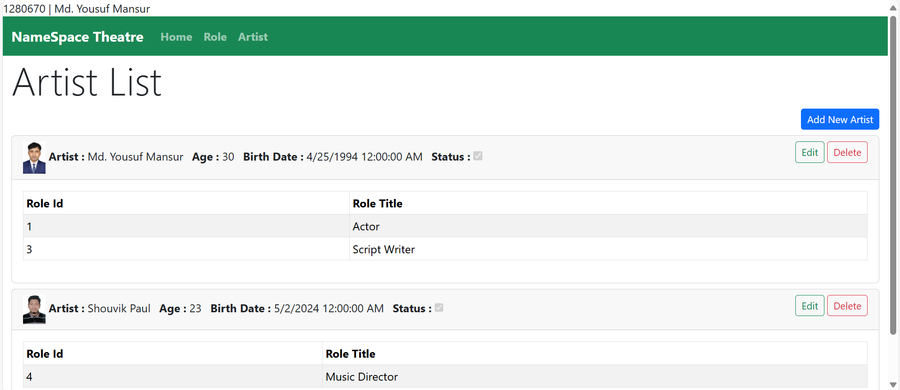
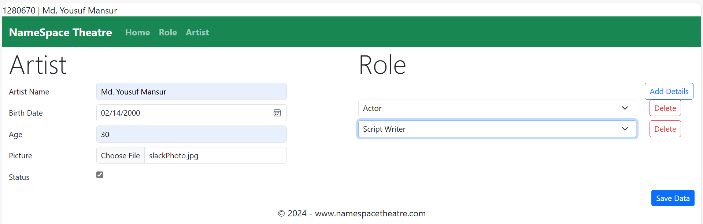
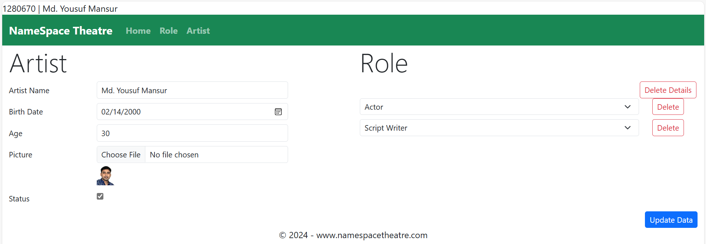
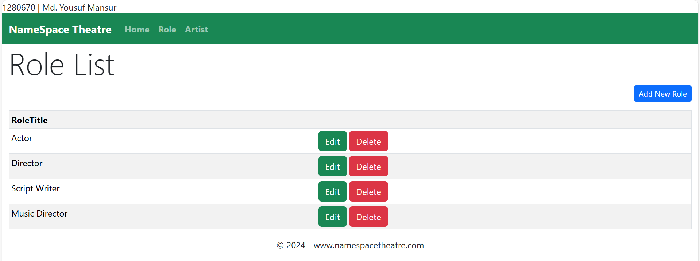

# Database First Asp.Net MVC Master-Details CRUD Application

This project is a Master-Details CRUD (Create, Read, Update, Delete) application built with ASP.NET MVC, Entity Framework 6.4.4, and jQuery Ajax. It demonstrates how to perform CRUD operations in a master-details relationship using modern web technologies.

## Features

- ASP.NET MVC framework
- Database First approach
- Entity Framework 6.4.4 for data access
- jQuery and Ajax for asynchronous operations
- Bootstrap for responsive design

## Prerequisites

- .NET Framework 4.8
- Visual Studio 2022 or later / Visual Studio Code
- SQL Server

## Installation

1. Clone the repository:
   
   git clone https://github.com/yousuf-mansur/db-first-theatre-management-crud.git
   
2. Open the project in Visual Studio:
   - Open the `your-repository-name.sln` file in Visual Studio.

3. Restore NuGet packages (if necessary):
   - Go to Tools > NuGet Package Manager > Package Manager Console.
   - Run the following command to restore the packages:
     
     Update-Package -reinstall
     

4. Set up the database:
   - In the Package Manager Console, run the following command to apply the migrations and create the database:
     
     Update-Database
     

## Running the Application

1. Press F5 or click the Start button in Visual Studio to run the application.
2. The application should open in your default web browser.

# Images View

# List View

## Insert Master and Details Data

# Edit Master and Details Data

# Details Index Data

## Details View Master and Details Data

 

## Usage

You can now perform CRUD operations on the master-details entities. The application uses jQuery Ajax to asynchronously handle details data operations, providing a smooth user experience.

## Project Structure

- `Controllers/` - Contains the MVC controllers for handling requests and responses.
- `Models/` - Contains the Entity Framework models and DbContext.
- `Views/` - Contains the views for rendering HTML.
- `wwwroot/` - Contains static files like CSS, JavaScript, and images.

## Technologies Used

- ASP.NET MVC 5 (specify the exact version you're using)
- Entity Framework 6.4.4
- jQuery (specify version)
- Ajax
- Bootstrap (specify version)
- SQL Server (specify version if applicable)

## Contributing

1. Fork the repository.
2. Create your feature branch (`git checkout -b feature/AmazingFeature`).
3. Commit your changes (`git commit -m 'Add some AmazingFeature'`).
4. Push to the branch (`git push origin feature/AmazingFeature`).
5. Open a pull request.

## License

This project is licensed under the MIT License - see the [LICENSE](LICENSE) file for details.

## About Me

I am Md. Yousuf Mansur, a full-stack developer specializing in web application development. My skills include:

- ASP.NET MVC and ASP.NET Core
- Angular and React for front-end development
- Entity Framework and Entity Framework Core
- SQL Server database management
- RESTful APIs and Web Services
- JavaScript, jQuery, and Ajax

My journey in software development began in 2023 with an IsDB-BISEW scholarship. I'm currently completing my scholarship course at Star Computer Systems Limited and gaining practical experience through an internship in Front-end development at ITransition Software Development Company in Dhaka, Bangladesh.

With a year of experience in web development, I am proficient in modern technologies and methodologies, enabling me to develop a wide range of web applications.

- Contact me For your Project
- E-mail: mansurmdyousuf@gmail.com
- WhatsApp: +880 1719983377
- LInkedIn: https://www.linkedin.com/in/md-yousuf-mansur/
